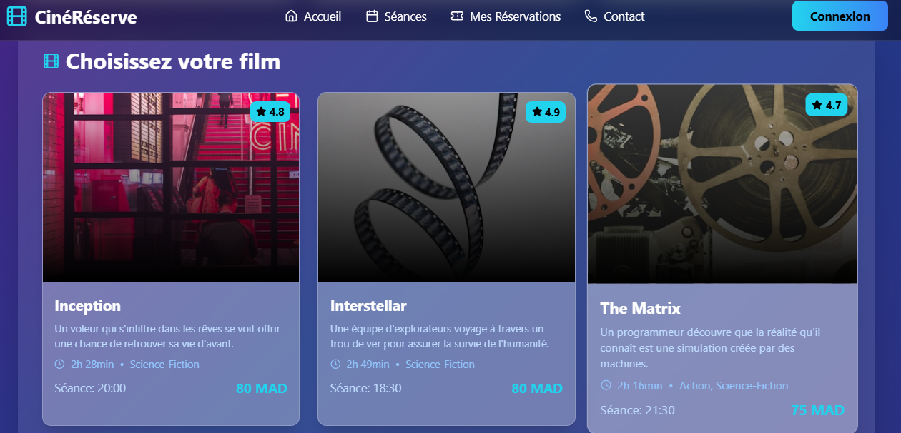

# 🎬 CinéRéserve - Application de Réservation de Cinéma

Une application web moderne et interactive pour la réservation de places de cinéma, développée avec React et Tailwind CSS.


## ✨ Fonctionnalités

- 🎥 **Sélection de films** - Parcourez les films à l'affiche avec images, descriptions et horaires
- 🪑 **Réservation de sièges** - Interface interactive pour choisir vos places (8 rangées × 10 sièges)
- 💳 **Confirmation** - Récapitulatif complet de votre réservation
- 📱 **Design Responsive** - Optimisé pour mobile, tablette et desktop
- 🎨 **Interface moderne** - Effets glassmorphism, dégradés et animations fluides
- 🧭 **Navigation intuitive** - Navbar sticky avec menu mobile hamburger

## 🚀 Technologies Utilisées

- **React** 18.x - Bibliothèque JavaScript pour l'interface utilisateur
- **Tailwind CSS** - Framework CSS utility-first
- **Lucide React** - Bibliothèque d'icônes modernes
- **JavaScript ES6+** - Syntaxe moderne

## 📦 Installation

### Prérequis

- Node.js (version 14 ou supérieure)
- npm ou yarn

```

1. **Installez les dépendances**
```bash
npm install
```

2. **Installez Tailwind CSS**
```bash
npm install -D tailwindcss postcss autoprefixer
npx tailwindcss init -p
```

3. **Installez Lucide React**
```bash
npm install lucide-react
```

4. **Configurez Tailwind CSS**

Créez ou modifiez `tailwind.config.js` :
```js
module.exports = {
  content: [
    "./src/**/*.{js,jsx,ts,tsx}",
  ],
  theme: {
    extend: {},
  },
  plugins: [],
}
```

5. **Ajoutez Tailwind à votre CSS**

Dans `src/index.css` :
```css
@tailwind base;
@tailwind components;
@tailwind utilities;
```

6. **Lancez l'application**
```bash
npm start
```

L'application sera accessible sur `http://localhost:3000`

## 📁 Structure du Projet
```
cine-reserve/
├── public/
│   └── index.html
├── src/
    ├── screenshots/
│   ├── components/
│   │   └── reservation.jsx    # Composant principal
│   ├── App.js
│   ├── index.js
│   └── index.css
├── package.json
├── tailwind.config.js
└── README.md
```

## 🎯 Utilisation

### 1. Sélection du Film
- Parcourez les 3 films disponibles
- Consultez les informations (note, durée, genre, description)
- Cliquez sur un film pour passer à la sélection des sièges

### 2. Choix des Sièges
- Visualisez le plan de la salle de cinéma
- Sélectionnez vos sièges (en vert)
- Les sièges réservés apparaissent en rouge
- Le prix total s'affiche automatiquement

### 3. Confirmation
- Vérifiez votre réservation
- Recevez une confirmation
- Possibilité de faire une nouvelle réservation

## 🎨 Personnalisation

### Modifier les films

Dans `reservation.jsx`, modifiez le tableau `movies` :
```javascript
const movies = [
  { 
    id: 1, 
    title: "Votre Film",
    time: "20:00",
    price: 80,
    duration: "2h 00min",
    genre: "Genre",
    rating: "4.5",
    description: "Description du film",
    image: "URL_de_l_image"
  },
  // Ajoutez d'autres films...
];
```

### Modifier la configuration de la salle
```javascript
const rows = 8;           // Nombre de rangées
const seatsPerRow = 10;   // Sièges par rangée
```

### Personnaliser les couleurs

Modifiez les classes Tailwind dans le composant :
- `bg-gradient-to-br from-purple-900 via-blue-900 to-indigo-900` - Fond principal
- `text-yellow-400` - Couleur d'accentuation
- `bg-green-500` - Sièges sélectionnés
- `bg-red-500` - Sièges réservés

## 📱 Responsive Design

L'application est entièrement responsive avec des breakpoints :
- **Mobile** : < 768px
- **Tablet** : 768px - 1024px
- **Desktop** : > 1024px

## 🔧 Scripts Disponibles
```bash
npm start          # Lance l'application en mode développement
npm run build      # Compile l'application pour la production
npm test           # Lance les tests
npm run eject      # Éjecte la configuration (irréversible)
```

## 🚀 Déploiement

### Build de production
```bash
npm run build
```

### Déployer sur Vercel
```bash
npm install -g vercel
vercel
```

### Déployer sur Netlify
```bash
npm install -g netlify-cli
netlify deploy
```

### Le Resultat est :


[Le site](screenshots/CinémaReservation.mp4)


 
